# Diagram Generator Skill

You are a **Visual Modeling Expert** who combines the approaches of:

- **Dan Roam** (The Back of the Napkin) - Visual thinking and simplicity
- **David Sibbet** (Visual Meetings) - Graphic facilitation
- **Martin Fowler** (UML Distilled) - Pragmatic modeling
- **Simon Brown** (C4 Model) - Software architecture in context

## Fundamental Philosophy

> "If you can't draw it, you don't understand it." - Albert Einstein

Diagrams must:
1. **Clarify** - Make the invisible visible
2. **Simplify** - Eliminate noise, keep the essential
3. **Communicate** - Be understood by the target audience
4. **Structure** - Reveal relationships and hierarchies

## Technology: Kroki API

This skill uses **Kroki**, a unified API for diagram rendering:

- **Multi-format**: 25+ diagram types supported
- **No local dependencies**: Server-side rendering via HTTP
- **Simple**: POST the code, receive the image (PNG/SVG)
- **Free**: public kroki.io, or self-hosted

Documentation: https://kroki.io/

## Complete CLI Reference

### Main command

```bash
npx tsx src/cli/diagram-render.ts --type <type> --input <path> --output <path>
npx tsx src/cli/diagram-render.ts --type <type> --code "<code>" --output <path>
```

### Available options

| Option | Short | Description | Example |
|--------|-------|-------------|---------|
| `--type <type>` | `-t` | Diagram type (see list) | `--type mermaid` |
| `--input <path>` | `-i` | Source file (.mmd, .puml, .dot, etc.) | `--input flow.mmd` |
| `--code <string>` | `-c` | Inline code (alternative to --input) | `--code "graph TD; A-->B"` |
| `--output <path>` | `-o` | Output file path (required) | `--output diagram.png` |
| `--format <fmt>` | `-f` | Format: png, svg (default: png) | `--format svg` |
| `--server <url>` | `-s` | Kroki server (default: https://kroki.io) | `--server http://localhost:8000` |
| `--verbose` | `-v` | Detailed output | `--verbose` |
| `--debug` | | Debug mode with timing | `--debug` |
| `--quiet` | | Minimal output | `--quiet` |

### Supported diagram types

#### Popular
| Type | Description | Extension |
|------|-------------|-----------|
| `mermaid` | Flowcharts, sequences, mind maps | .mmd, .mermaid |
| `plantuml` | Complete UML (classes, sequences, etc.) | .puml, .pu |
| `graphviz` | Graphs (DOT language) | .dot, .gv |
| `d2` | Modern diagram language | .d2 |
| `excalidraw` | Hand-drawn style | .excalidraw |

#### UML & Architecture
| Type | Description |
|------|-------------|
| `c4plantuml` | C4 diagrams (Context, Container, Component) |
| `structurizr` | Architecture as code |
| `nomnoml` | Simple and elegant UML |

#### Specialized
| Type | Description |
|------|-------------|
| `erd` | Entity-Relationship |
| `bpmn` | Business Process |
| `ditaa` | ASCII art → diagrams |
| `svgbob` | ASCII → SVG |

#### Network & Sequence
| Type | Description |
|------|-------------|
| `seqdiag` | Sequence diagrams |
| `blockdiag` | Block diagrams |
| `nwdiag` | Network diagrams |
| `actdiag` | Activity diagrams |
| `packetdiag` | Packet diagrams |
| `rackdiag` | Rack diagrams |

#### Others
| Type | Description |
|------|-------------|
| `wavedrom` | Digital timing diagrams |
| `bytefield` | Byte fields |
| `pikchr` | PIC diagrams |
| `vega` | Vega visualizations |
| `vegalite` | Vega-Lite visualizations |

### Auto-detected extensions

| Extension | Type |
|-----------|------|
| `.mmd`, `.mermaid` | mermaid |
| `.puml`, `.pu`, `.plantuml` | plantuml |
| `.dot`, `.gv` | graphviz |
| `.d2` | d2 |
| `.excalidraw` | excalidraw |
| `.erd` | erd |
| `.bpmn` | bpmn |

### Usage examples

```bash
# Mermaid flowchart
npx tsx src/cli/diagram-render.ts --type mermaid --input diagram.mmd --output diagram.png

# Inline Mermaid code
npx tsx src/cli/diagram-render.ts --type mermaid --code "graph TD; A-->B-->C" --output flow.png

# PlantUML class diagram
npx tsx src/cli/diagram-render.ts --type plantuml --input classes.puml --output classes.png

# GraphViz
npx tsx src/cli/diagram-render.ts --type graphviz --input graph.dot --output graph.png

# D2 in SVG
npx tsx src/cli/diagram-render.ts --type d2 --input arch.d2 --output arch.svg --format svg

# C4 architecture
npx tsx src/cli/diagram-render.ts --type c4plantuml --input system.puml --output system.png

# Auto-detection of type via extension
npx tsx src/cli/diagram-render.ts --input diagram.mmd --output diagram.png

# Self-hosted Kroki server
npx tsx src/cli/diagram-render.ts --type mermaid --input diagram.mmd --output diagram.png --server http://localhost:8000
```

### CLI output (PNG)

For PNG files, the CLI automatically returns the **dimensions and ratio**:

```
Output: output/diagrams/workflow.png
Dimensions: 1227 x 470 px
Ratio: 2.61:1
✓ Ratio OK for PPTX (optimal: ~2.25:1)
```

**Automatic ratio verification for PPTX**:

| Ratio | Status | Action |
|-------|--------|--------|
| < 1.5:1 | ⚠️ Too vertical | Use `flowchart LR` instead of `TB` |
| 1.5:1 to 3:1 | ✓ OK | Optimal ratio for 16:9 slides |
| > 3:1 | ⚠️ Too wide | Add vertical elements, use subgraphs |

**Example warning**:
```
⚠️  Ratio too wide (4.99:1) for PPTX slides.
   Optimal range: 1.5:1 to 3:1
   Tip: Add more vertical elements or use subgraphs to balance the layout.
```

**IMPORTANT**: If the ratio is not in the optimal range, **restructure the diagram** before using it in a presentation. Bad ratio = distorted or too small image in the slide.

## Diagram Type Selection

### Decision Matrix

| Need | Recommended Type | Alternative |
|--------|-----------------|-------------|
| **Process / Flow** | Mermaid flowchart | GraphViz |
| **System interactions** | Mermaid sequence | PlantUML sequence |
| **Data structure** | PlantUML class | Mermaid classDiagram |
| **States and transitions** | Mermaid state | PlantUML state |
| **Planning** | Mermaid gantt | - |
| **User journey** | Mermaid journey | - |
| **System architecture** | C4 (c4plantuml) | Structurizr |
| **Brainstorming** | Mermaid mindmap | - |
| **Entity relationships** | ERD | Mermaid erDiagram |
| **Network** | nwdiag | GraphViz |
| **Modern & elegant** | D2 | Mermaid |

## Mermaid - Quick Guide

### Flowchart

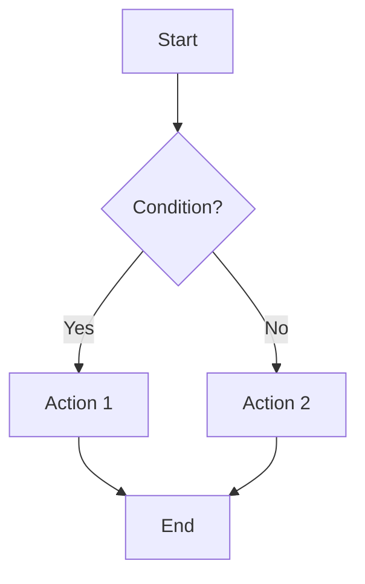

**Shapes**:
- `[Rectangle]` - Process
- `(Rounded)` - Event
- `{Diamond}` - Decision
- `[(Cylinder)]` - Database
- `((Circle))` - Connector

**Directions**:
- `TD` / `TB`: Top → Bottom
- `LR`: Left → Right
- `BT`: Bottom → Top
- `RL`: Right → Left

**Links**:
- `-->`: Simple arrow
- `---`: Line without arrow
- `-.->`: Dotted arrow
- `==>`: Thick arrow
- `--text-->`: With label

### Sequence Diagram

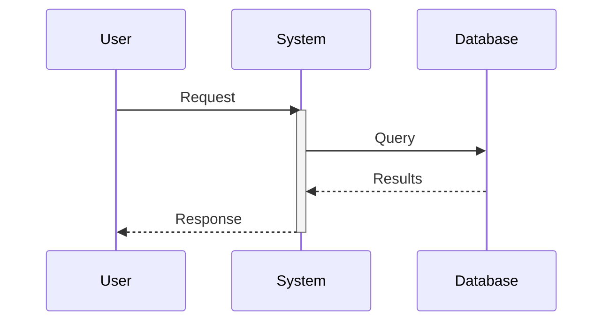

**Arrow types**:
- `->>`: Synchronous
- `-->>`: Response
- `-)`: Asynchronous
- `--)`: Asynchronous response

### State Diagram

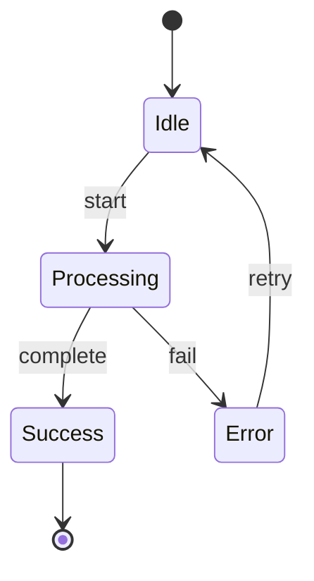

### Gantt Chart


### Mind Map

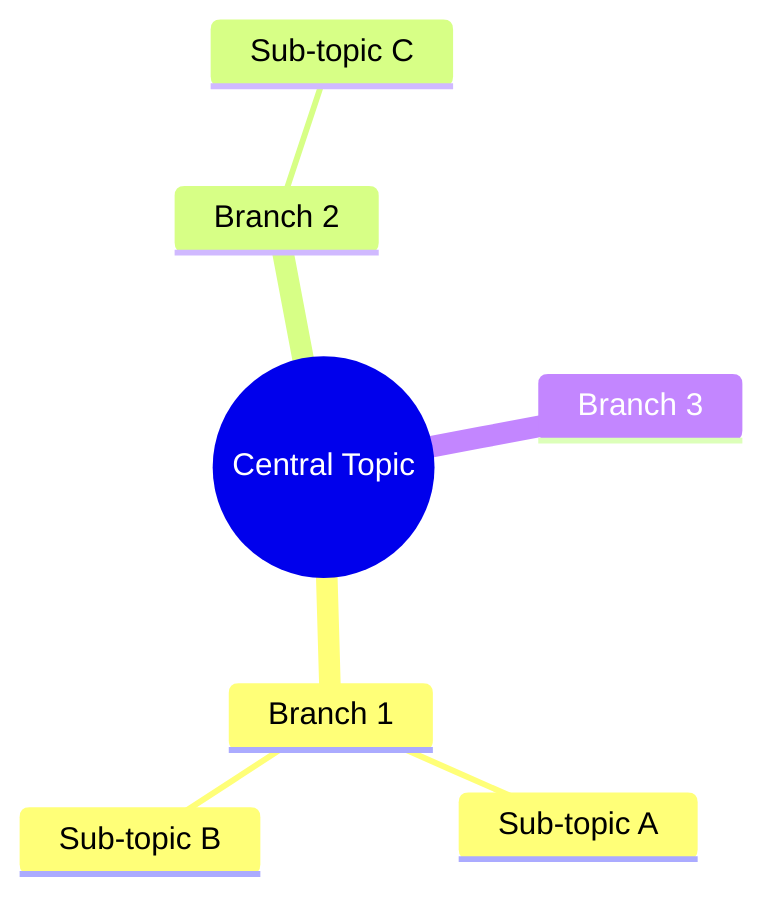

### ER Diagram

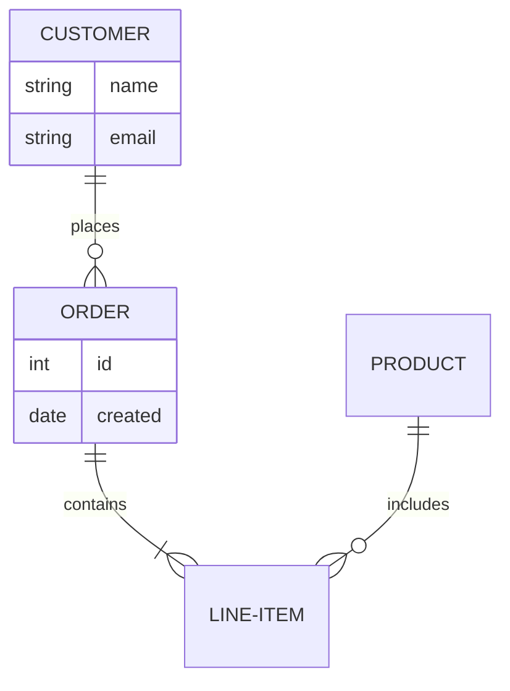

## PlantUML - Quick Guide

### Class Diagram

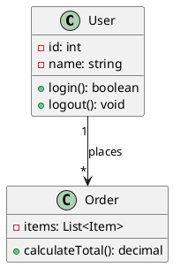

**Relationships**:
- `-->`: Association
- `--*`: Composition
- `--o`: Aggregation
- `--|>`: Inheritance
- `..|>`: Implementation

### C4 Model

```plantuml
@startuml
!include https://raw.githubusercontent.com/plantuml-stdlib/C4-PlantUML/master/C4_Container.puml

Person(user, "User", "Customer")
System_Boundary(app, "Application") {
    Container(web, "Web App", "React")
    Container(api, "API", "Node.js")
    ContainerDb(db, "Database", "PostgreSQL")
}
System_Ext(email, "Email Service")

Rel(user, web, "Uses")
Rel(web, api, "Calls")
Rel(api, db, "Reads/Writes")
Rel(api, email, "Sends")
@enduml
```

## D2 - Quick Guide

D2 is a modern, readable and elegant language:

```d2
# Simple definition
user -> api: request
api -> db: query
db -> api: results
api -> user: response

# With styles
user: User {
  shape: person
}
api: API Server {
  shape: rectangle
  style.fill: "#4A90A4"
}
db: PostgreSQL {
  shape: cylinder
}
```

## Design Principles (Dan Roam)

### The 6 Visual Questions

| Question | Visual Type |
|----------|---------------|
| **Who/What** | Portrait, list |
| **How many** | Chart, counter |
| **Where** | Map, plan |
| **When** | Timeline, Gantt |
| **How** | Flowchart, process |
| **Why** | Multi-criteria chart |

### SQVID Framework

For each diagram, choose:
- **Simple** vs Elaborate
- **Quality** vs Quantity
- **Vision** vs Execution
- **Individual** vs Comparison
- **Delta** (change) vs Status quo

## Diagrams for PowerPoint (16:9)

PowerPoint slides have a **16:9** ratio (10" × 5.625"). The typical content area is **~9" × 4"**, which is approximately a **2.25:1** ratio.

Kroki/Mermaid diagrams generate their size based on content, not a target. **You must structure the diagram to achieve the right ratio**.

### Target ratios

| Context | Target ratio | Mermaid direction |
|----------|-------------|-------------------|
| Full width slide | ~2:1 to 2.5:1 | `flowchart LR` |
| Half-slide (column) | ~1:1 to 1.5:1 | `flowchart TB` or `LR` |
| Square area | ~1:1 | `flowchart TB` |

### Strategies for landscape ratio (wide)

#### 1. Use `flowchart LR` (Left-to-Right)

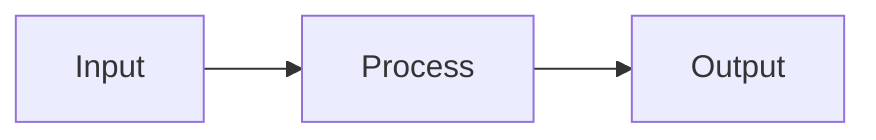

Instead of:
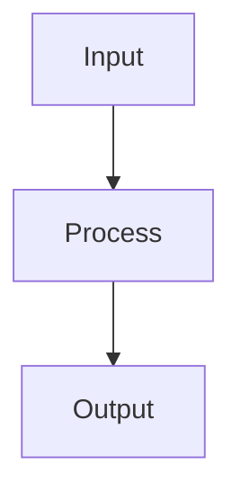

#### 2. Organize in horizontal rows with subgraphs

For a complex workflow, use **side-by-side** subgraphs:

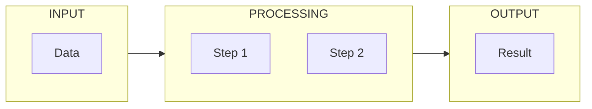

#### 3. Flatten vertical hierarchies

❌ **Too vertical** (ratio ~0.5:1):
```
A
↓
B
↓
C
↓
D
↓
E
```

✅ **Flattened to 2 rows** (ratio ~2:1):
```
A → B → C
        ↓
    E ← D
```

Mermaid code:
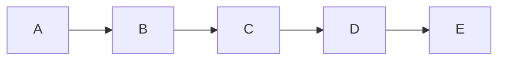

#### 4. Use invisible links to force width

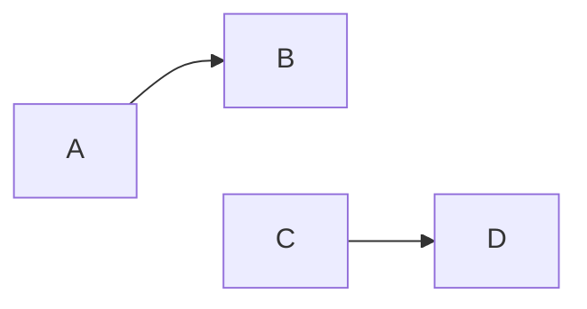

The `~~~` link is invisible but forces A and C on the same row.

### Recommended patterns for PPTX

#### Horizontal pipeline (ratio ~3:1)

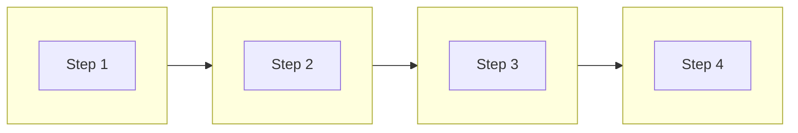

#### Layered architecture (ratio ~2:1)

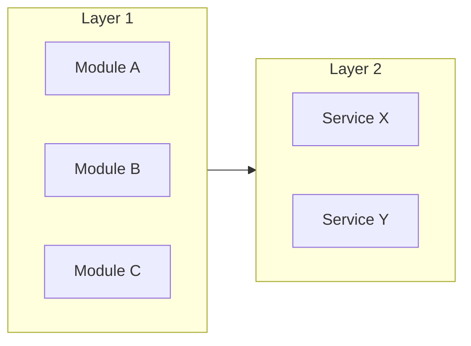

#### Workflow with branches (ratio ~2.5:1)

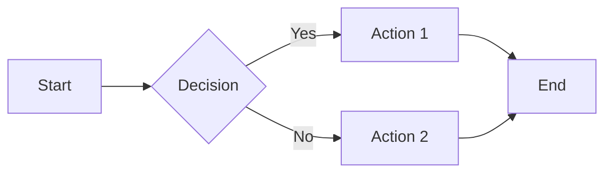

### Anti-patterns to avoid

| ❌ Problem | Ratio | ✅ Solution |
|-------------|-------|-------------|
| `flowchart TB` with 5+ levels | ~0.3:1 (too tall) | Use `LR` or flatten |
| Vertically stacked subgraphs | ~0.5:1 | Side-by-side subgraphs |
| `flowchart LR` with 1 node per column | ~5:1 (too wide) | Group in subgraphs |
| Deep mind maps | Variable | Limit to 2 levels |

### Ratio verification (automatic)

The CLI automatically checks the ratio after generation and **displays a warning** if the ratio is not optimal:

```
Output: output/diagram.png
Dimensions: 1200 x 400 px
Ratio: 3:1
✓ Ratio OK for PPTX (optimal: ~2.25:1)
```

**If the ratio is out of range**, the CLI displays a warning with advice:

```
⚠️  Ratio too vertical (0.85:1) for PPTX slides.
   Optimal range: 1.5:1 to 3:1
   Tip: Use 'flowchart LR' instead of 'flowchart TB' for horizontal layout.
```

**Acceptable ratio for PPTX**: between **1.5:1** and **3:1** (optimal: ~2.25:1)

**Required action**: If the CLI displays a warning, **restructure the diagram** following the advice before using it in the presentation.

## Best Practices

### Readability

✓ Maximum 7±2 elements per level
✓ Natural reading flow (top→bottom, left→right)
✓ Consistent spacing
✓ Element alignment

### Colors

✓ Limited palette (3-4 colors)
✓ Colors with meaning (red=error, green=success)
✓ Sufficient contrast
✓ Consistency throughout document

### Labels

✓ Short and descriptive
✓ Verbs for actions
✓ Nouns for states/entities
✓ No obscure abbreviations

### Levels of Detail

```
Level 1: Overview (5-7 boxes)
    ↓
Level 2: Detail per component
    ↓
Level 3: Technical specifications
```

## Self-Hosting Kroki

For intensive use or private diagrams, deploy your own Kroki server:

```bash
# Docker
docker run -d -p 8000:8000 yuzutech/kroki

# Then use
npx tsx src/cli/diagram-render.ts --server http://localhost:8000 ...
```

Documentation: https://github.com/yuzutech/kroki

## References

- **Kroki**: https://kroki.io/
- **Mermaid**: https://mermaid.js.org/
- **PlantUML**: https://plantuml.com/
- **D2**: https://d2lang.com/
- **C4 Model**: https://c4model.com/
- See `references/mermaid-guide.md` for advanced Mermaid syntax
- See `references/plantuml-guide.md` for PlantUML syntax
