# Guide Mermaid Complet

## Configuration Globale

```mermaid
%%{init: {
  'theme': 'base',
  'themeVariables': {
    'primaryColor': '#4A90A4',
    'primaryTextColor': '#fff',
    'primaryBorderColor': '#2E5A6B',
    'lineColor': '#333',
    'secondaryColor': '#F5F5F5',
    'tertiaryColor': '#E8E8E8'
  }
}}%%
```

## Flowchart Avancé

### Sous-graphes

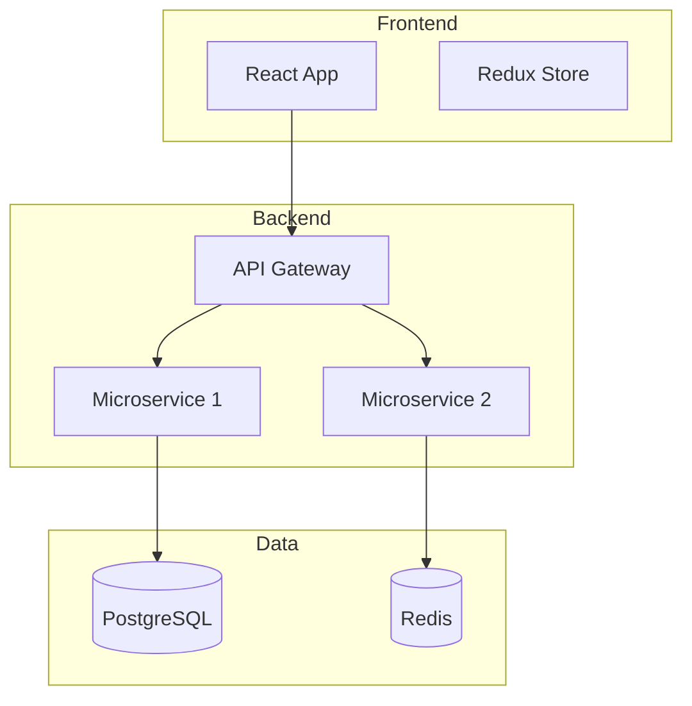

### Styles Personnalisés

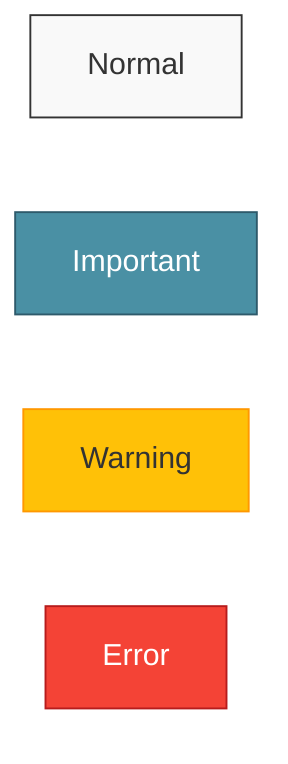

### Liens avec Styles

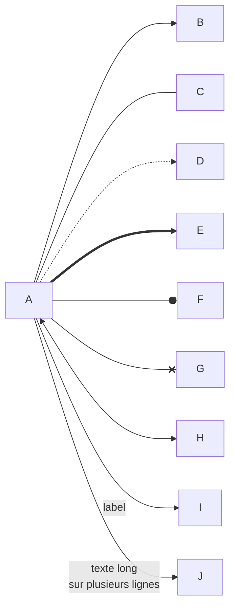

## Sequence Diagram Avancé

### Activation et Désactivation

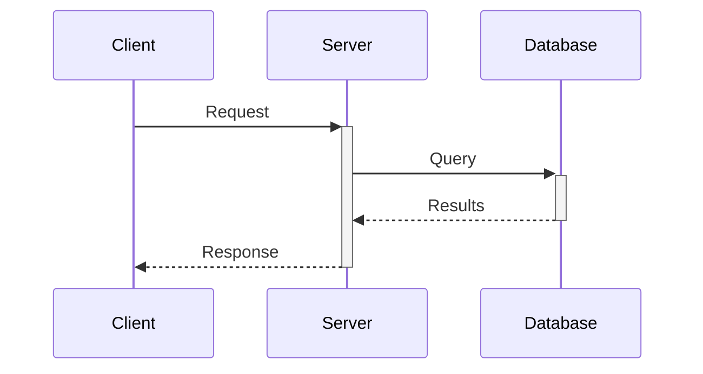

### Boucles et Alternatives

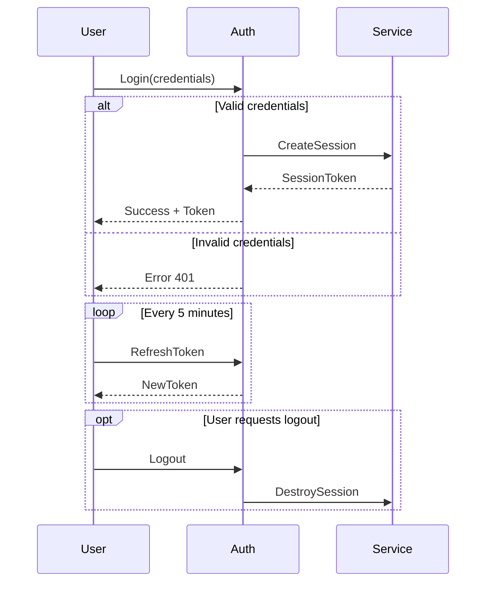

### Notes et Rectangles

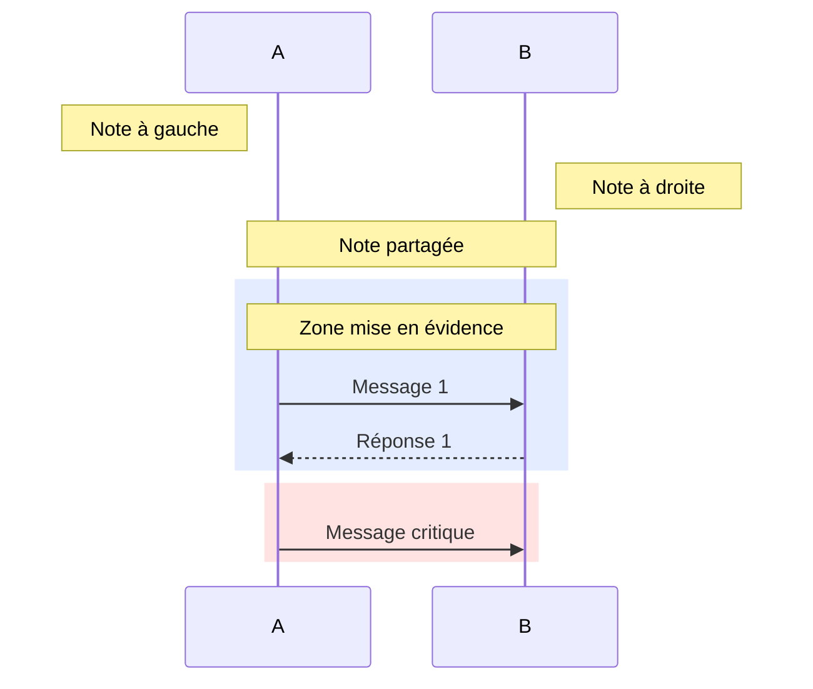

## State Diagram Avancé

### États Composites

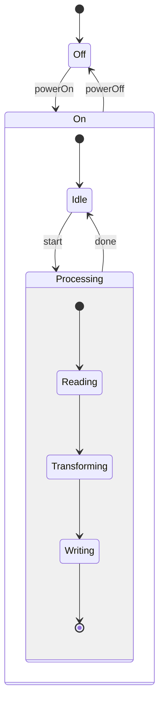

### Forks et Joins

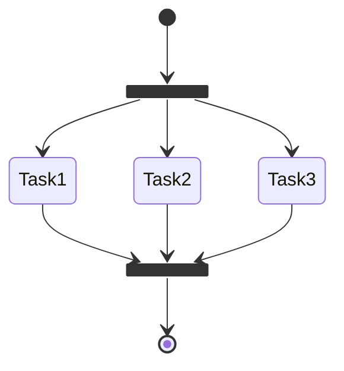

## Gantt Avancé

### Dépendances et Jalons

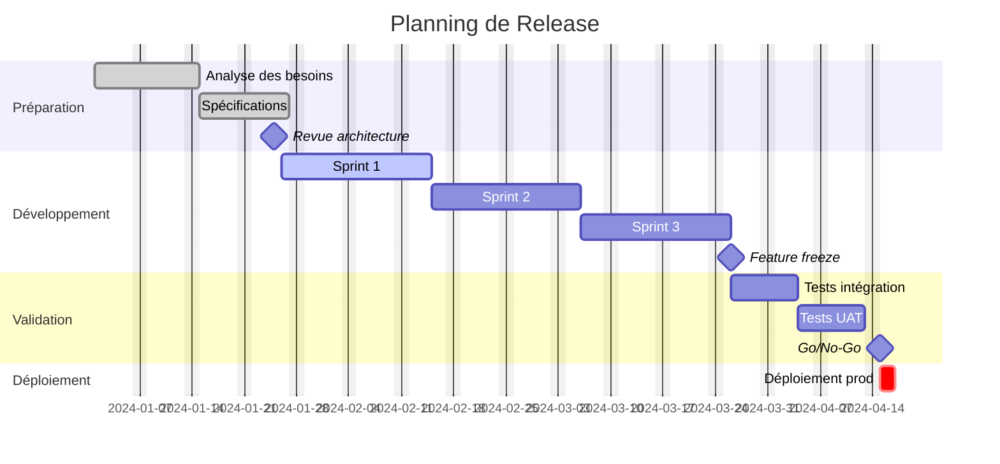

## Pie Chart

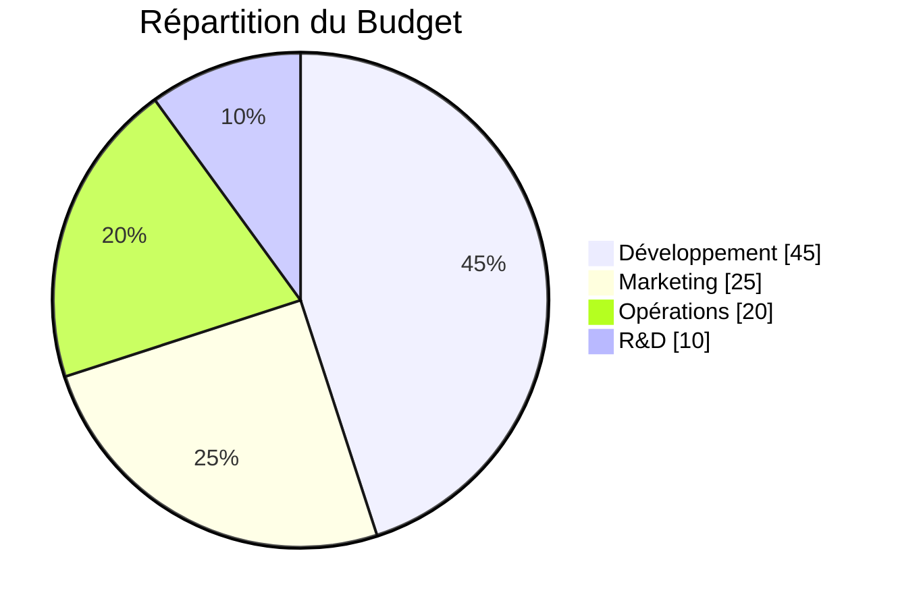

## Git Graph

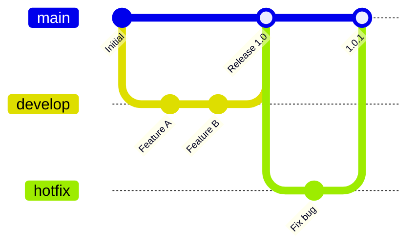

## Quadrant Chart

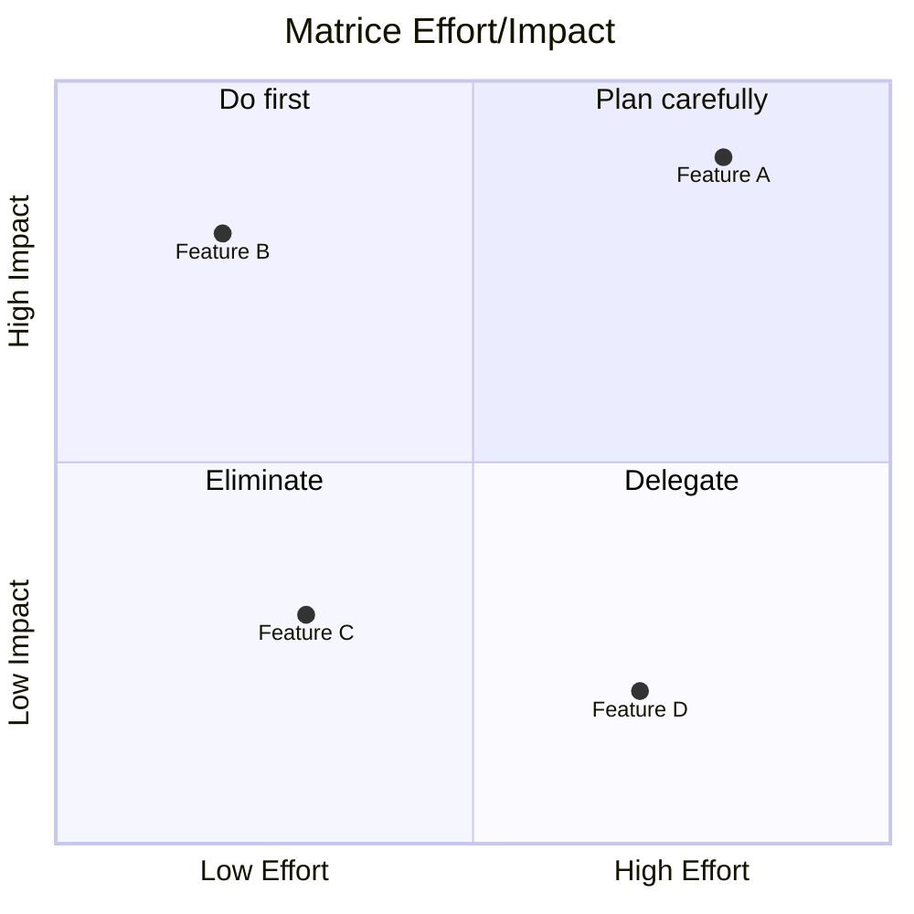

## Timeline

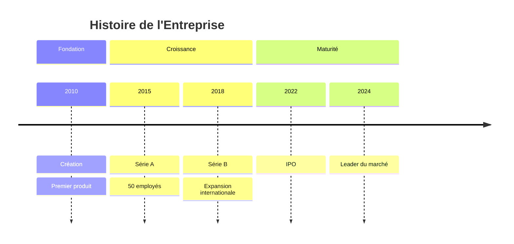

## Thèmes Disponibles

```
%%{init: {'theme': 'default'}}%%    # Standard
%%{init: {'theme': 'forest'}}%%     # Vert naturel
%%{init: {'theme': 'dark'}}%%       # Mode sombre
%%{init: {'theme': 'neutral'}}%%    # Gris neutre
%%{init: {'theme': 'base'}}%%       # Base personnalisable
```
