# Guide PlantUML Complet

## Configuration de Base

```plantuml
@startuml
' Configuration globale
skinparam backgroundColor #FFFFFF
skinparam defaultFontName Arial
skinparam defaultFontSize 12

' Couleurs
skinparam class {
    BackgroundColor #F5F5F5
    BorderColor #333333
    ArrowColor #666666
}
@enduml
```

## Class Diagram

### Relations Complètes

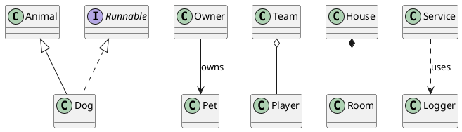

### Visibilité et Modificateurs

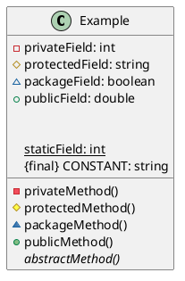

### Stéréotypes et Notes

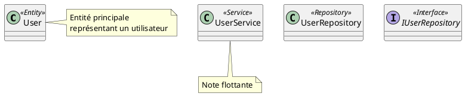

## Sequence Diagram

### Participants Typés

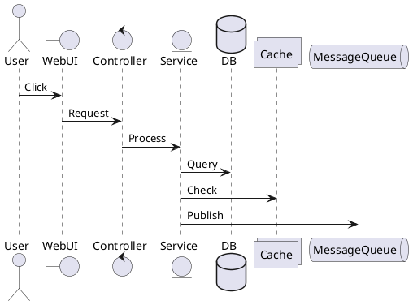

### Groupes et Dividers

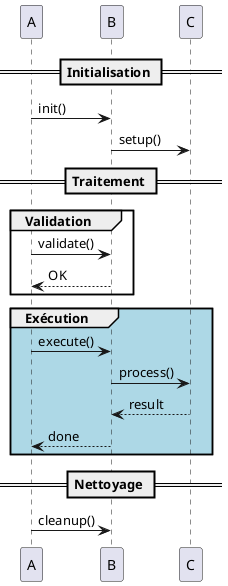

### Création et Destruction

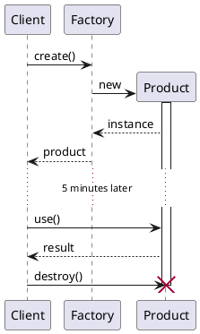

## Activity Diagram

### Flux de Base

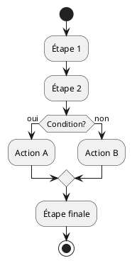

### Parallélisme et Swimlanes

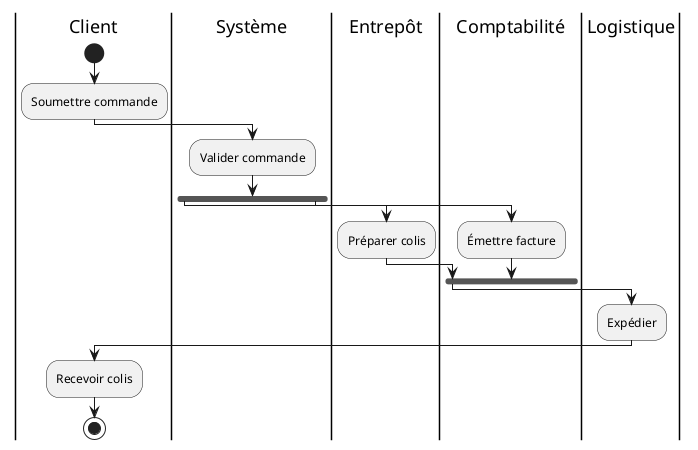

## Component Diagram

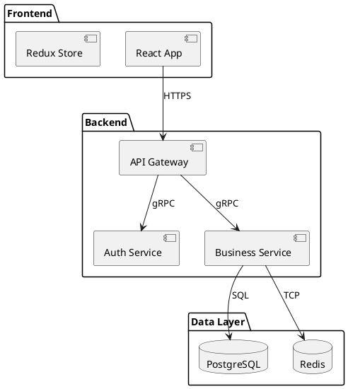

## Deployment Diagram

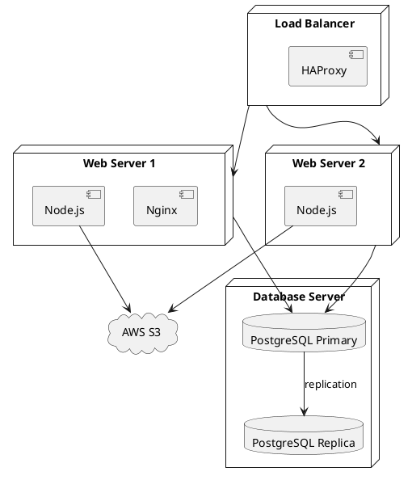

## Use Case Diagram

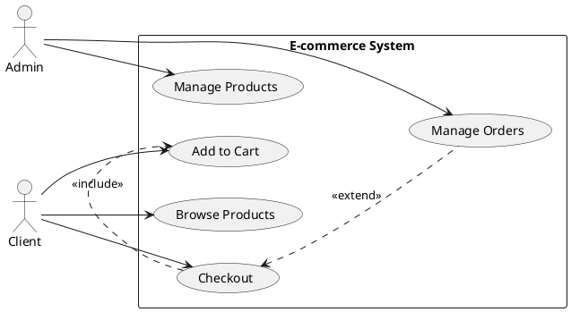

## C4 Model

### Context Diagram

```plantuml
@startuml
!include https://raw.githubusercontent.com/plantuml-stdlib/C4-PlantUML/master/C4_Context.puml

LAYOUT_WITH_LEGEND()

Person(user, "Utilisateur", "Client de l'application")
Person(admin, "Administrateur", "Gère le système")

System(app, "Notre Application", "Application principale")
System_Ext(payment, "Système de Paiement", "Stripe")
System_Ext(email, "Service Email", "SendGrid")

Rel(user, app, "Utilise")
Rel(admin, app, "Administre")
Rel(app, payment, "Traite paiements")
Rel(app, email, "Envoie emails")
@enduml
```

### Container Diagram

```plantuml
@startuml
!include https://raw.githubusercontent.com/plantuml-stdlib/C4-PlantUML/master/C4_Container.puml

LAYOUT_WITH_LEGEND()

Person(user, "Utilisateur")

System_Boundary(app, "Application") {
    Container(spa, "SPA", "React", "Interface utilisateur")
    Container(api, "API", "Node.js/Express", "API REST")
    Container(worker, "Worker", "Node.js", "Tâches async")
    ContainerDb(db, "Database", "PostgreSQL", "Données")
    ContainerQueue(queue, "Queue", "Redis", "Messages")
}

Rel(user, spa, "HTTPS")
Rel(spa, api, "JSON/HTTPS")
Rel(api, db, "SQL/TCP")
Rel(api, queue, "Publish")
Rel(worker, queue, "Subscribe")
Rel(worker, db, "SQL/TCP")
@enduml
```

## Styles et Thèmes

### Thème Personnalisé

```plantuml
@startuml
!define PRIMARY #4A90A4
!define SECONDARY #F5F5F5
!define ACCENT #E15759

skinparam backgroundColor white
skinparam handwritten false

skinparam class {
    BackgroundColor SECONDARY
    BorderColor PRIMARY
    FontColor #333333
}

skinparam sequence {
    ArrowColor PRIMARY
    LifeLineBorderColor PRIMARY
    ParticipantBackgroundColor SECONDARY
    ParticipantBorderColor PRIMARY
}

skinparam note {
    BackgroundColor #FFFDE7
    BorderColor #FFC107
}
@enduml
```

### Icônes et Sprites

```plantuml
@startuml
!include <office/Servers/application_server>
!include <office/Servers/database_server>
!include <office/Devices/device_laptop>

OFF_DEVICE_LAPTOP(laptop, "Client")
OFF_APPLICATION_SERVER(server, "API Server")
OFF_DATABASE_SERVER(db, "Database")

laptop --> server
server --> db
@enduml
```
